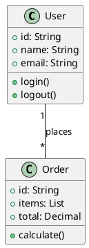

## Schritt 1: PlantUML-Datei erstellen

Erstelle eine neue `.puml`-Datei im Verzeichnis `uml/` (außerhalb von `astro_starlight/`):

```
uml/
├── mein-diagramm.puml          # Direkt im uml-Ordner
└── unterordner/                # Oder in Unterordnern
    └── weiteres-diagramm.puml
```

## Schritt 2: PlantUML-Syntax schreiben

Beispiel für ein einfaches Klassendiagramm (`uml/beispiel.puml`):



## Schritt 3: SVG wird automatisch generiert

- **Entwicklung**: Das Diagramm wird automatisch als SVG generiert, sobald du die `.puml`-Datei speicherst
- **Build**: Beim `npm run build` werden alle PlantUML-Diagramme automatisch zu SVGs konvertiert
- Die SVGs werden in `astro_starlight/public/uml-generated/` gespeichert

## Nützliche PlantUML-Diagrammtypen

PlantUML unterstützt verschiedene Diagrammtypen:

| Diagrammtyp | Beschreibung |
|-------------|--------------|
| Klassendiagramm | Klassen und Beziehungen |
| Sequenzdiagramm | Interaktionsabläufe |
| Komponentendiagramm | Komponenten und Schnittstellen |
| Deployment-Diagramm | Infrastruktur und Deployment |
| Use-Case-Diagramm | Anwendungsfälle |

Weitere Informationen: [PlantUML Dokumentation](https://plantuml.com/de/)

## Tipps

- **Hot Reload**: Im Dev-Modus (`npm run dev`) werden PlantUML-Änderungen automatisch erkannt und die Seite neu geladen
- **Unterordner**: Du kannst beliebig viele Unterordner in `uml/` anlegen - die Struktur wird automatisch erkannt
- **Fehlersuche**: Wenn ein Diagramm nicht angezeigt wird, prüfe die Browser-Konsole auf Fehler und stelle sicher, dass die PlantUML-Syntax korrekt ist
