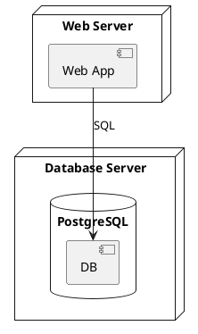

import PlantUML from '@components/PlantUML.astro'

## PlantUML-Komponente importieren

Um ein PlantUML-Diagramm in deine MDX-Seite einzubinden, importiere die `PlantUML`-Komponente:

```mdx
---
title: Meine Architektur-Seite
description: Zeigt die Systemarchitektur
---

import PlantUML from '@components/PlantUML.astro'

## Systemübersicht

Hier ist das Architekturdiagramm:

<PlantUML file="mein-diagramm" title="Systemarchitektur" />
```

## Parameter der PlantUML-Komponente

Die `PlantUML`-Komponente akzeptiert folgende Props:

| Parameter | Typ | Beschreibung | Beispiel |
|-----------|-----|--------------|----------|
| `file` | `string` | Dateiname ohne `.puml` (relativ zu `uml/`) | `"beispiel"` oder `"unterordner/beispiel"` |
| `title` | `string` (optional) | Bildunterschrift | `"Mein Diagramm"` |

## Beispiele

```mdx
<!-- Diagramm aus uml/file1.puml -->
<PlantUML file="file1" title="Beispiel" />

<!-- Diagramm aus uml/ordnerA/file2.puml -->
<PlantUML file="ordnerA/file2" title="Weiteres Beispiel" />

<!-- Ohne Titel -->
<PlantUML file="mein-diagramm" />
```

## Live-Beispiel

So sieht ein eingebundenes Diagramm aus:

<PlantUML file="file1" title="Beispiel-Diagramm" />

## Vollständiges Beispiel

### 1. Erstelle das Diagramm: `uml/deployment.puml`



### 2. Erstelle die Dokumentationsseite: `docs/deployment/overview.mdx`

```mdx
---
title: Deployment-Übersicht
description: Zeigt die Deployment-Architektur
---

import PlantUML from '@components/PlantUML.astro'

## Deployment-Architektur

Unsere Anwendung wird auf zwei Servern deployed:

<PlantUML file="deployment" title="Deployment-Diagramm" />

## Server-Konfiguration

- **Web Server**: Nginx + Node.js
- **Database Server**: PostgreSQL 15
```

## Weiterführende Links

- [UML-Diagramm erstellen](./uml-diagramm-erstellen/)
- [PlantUML Dokumentation](https://plantuml.com/de/)
